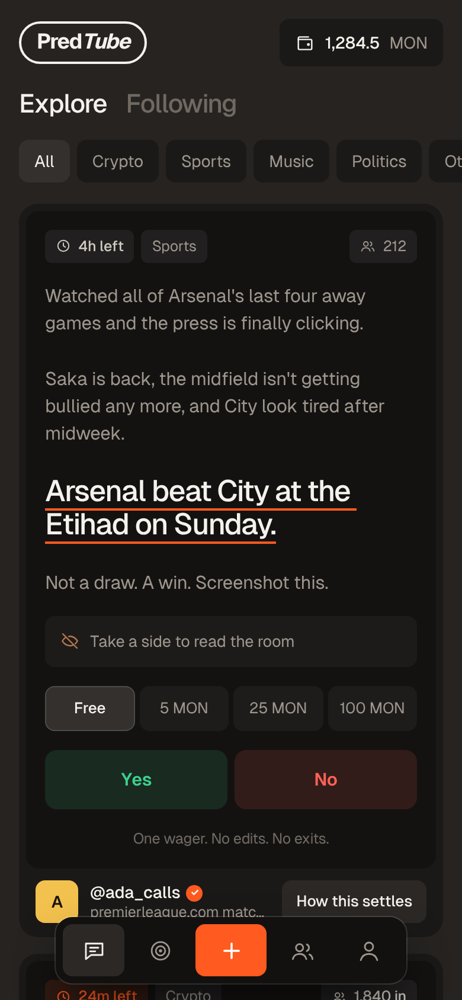
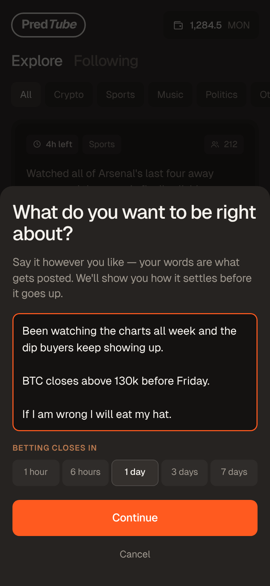
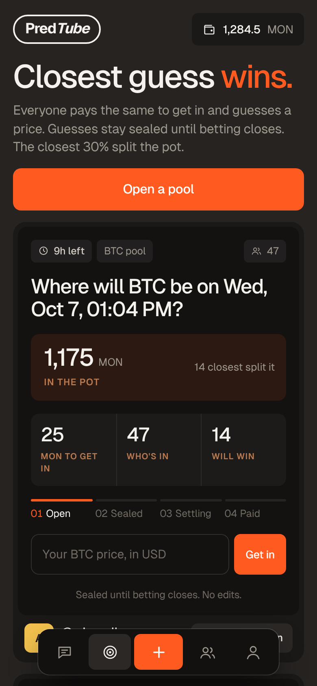

# PredMon

**A social prediction market on Monad mainnet.** Say what you think will happen, in your own words. Everyone else votes for free, backs their side with MON if they want to, and an AI resolver settles it with cited evidence.

Built for the Metropolis hackathon, Track 3 (Social, Attention & Culture). Everything is in MON on Monad (chain id 143).



## What it is

PredMon has two feeds and one reputation.

**Calls.** You write a post in plain language. The AI picks the one line that carries the prediction, highlights it, and fixes clear yes/no terms. Your paragraphs and wording stay as you wrote them. Other people get one free, gasless vote and can optionally stake MON on the same side. The bars stay hidden until you have voted. When the call ends, the AI resolver settles it as YES, NO or VOID, and cites its sources.

**Pools.** Someone opens a pool on an asset (BTC, ETH or MON) with a result time and an entry fee. Everyone submits a sealed price guess. After the result, the closest 30% share the pot, with more going to the closer guesses.

**Reputation.** Every call and pool you win or lose moves a score, kept per category (Crypto, Sports, Music, Politics, Other) and stored onchain. Money never buys it.

| | |
|---|---|
|  |  |

## Repository layout

```
contracts/   Reputation, Calls, Pools (Solidity 0.8.28, cancun)
server/      Node API and job loop: auth, AI gate, resolver, relayer, settlement
web/         React app. Open it with ?preview to see every screen on sample data
cre/         Chainlink CRE workflows (pool prices, call outcomes)
indexer/     Envio HyperIndex config and handlers
scripts/     compile, deploy, set-caps
test/        contract tests and a full server end-to-end test
design/      screenshots of the current UI
```

## Stack

- **Chain:** Monad mainnet, Solidity 0.8.28, pull payments, reentrancy guards, EIP-712 relayed votes, commit-reveal guesses.
- **Accounts:** Dynamic. Sign in with Google (an in-app wallet is created), a verified tick from a linked X account, and a passkey step-up for large amounts.
- **Top-up:** Aurora swap widget.
- **Settlement:** Chainlink CRE workflows for prices and outcomes, with a settler wallet as the backend path.
- **Prices:** Chainlink feeds.
- **Indexing:** Envio HyperIndex.
- **AI:** Anthropic API with web search for the gate and the resolver.
- **Web:** Vite, React, TypeScript, viem.

## Rules as built

**Calls**
- Duration 5 minutes to 7 days. 5 posts per day per user.
- One free gasless vote per user. An optional stake goes on the same side, up to `maxStake`.
- Votes lock for the last 10% of the call's life.
- Vote weight is the reputation factor (1x to 2x) times a time factor (1.2x falling to 1.0x).
- After the call ends there is a 2-hour dispute hold before settlement.
- Winners split the losing pool. 2% of the losing pool goes to the author.
- A void market, or one where everyone picked the same side, refunds everyone and changes no reputation.
- Comments are allowed only after you have voted.

**Pools**
- The creator picks the asset, the result time and the entry (at most `maxEntry`). 3 pools per day per user. Maximum 300 entries.
- Guesses are sealed. They must be revealed before the result time, and the server does this for you.
- Entries lock 3 hours before the result.
- The closest 30% (at least one) share the pot on linear rank weights.
- Everyone is refunded if fewer than 3 guesses are revealed, no price arrives within 24 hours, or the ranking is unfinished 72 hours after the price.
- Only a user's first entry earns reputation. There is no creator fee.
- The settler (or owner) submits the ranking and the contract verifies the order, so nobody can jam a pool by skipping an entry.

**Reputation** (stored x100)
- Calls: a win is +10(1 − s) and a loss is −10s.
- Pools: +10 for the closest guess down to −10 for the furthest.

**Safety**
- The owner can pause, which stops new activity only. Claims and refunds always work.
- `voidMarket` and `voidPool` refund everyone.
- Caps start at 1 MON and are raised after a dry run with `scripts/set-caps.mjs`.

## Run it

```
npm install && npm test          # compiles, then 45 tests on an in-process chain
cd cre && npm i && npm run check
cd web && npm i && npx tsc --noEmit && npx vite build
cd web && npm run dev            # then open /?preview&tab=calls
```

Preview URLs: `?preview&tab=calls|pools|people|me|wallet`, `?preview=signin`, `?preview=username`, `?preview&compose`.

## What is verified, and what is not

**Verified by tests.** All contract rules: windows, caps, blind-until-voted weights, signed votes, settlement with hold and correction, void and refund paths, payout maths including randomised money-conservation checks, commit-reveal, ranking checks, and pause never blocking claims. Also the deploy script, and the whole server flow against real contracts with the AI and token check faked.

**Not verified. Check each before real money:**
1. **Nothing is deployed.** No mainnet transaction has been sent.
2. **Dynamic.** Sign-in, wallet creation, the JWT claim layout (`verified_credentials`, `scope`), the X badge, passkey step-up, and signing from the in-app wallet. Enable Monad (chain 143 and an RPC) as a network in the Dynamic dashboard.
3. **Aurora deposit widget.** It needs a Widget Studio key. Whether MON lands on Monad in the in-app wallet is untested.
4. **Chainlink CRE workflows.** They type-check against SDK 1.23 but have not run on a DON, and deploy access is gated. The forwarder metadata layout (workflow owner at bytes 42..62) is assumed. The contracts also accept a plain settler wallet, which is what the backend uses and what is tested. Chainlink feed addresses for Monad are not filled in.
5. **Envio.** Config and handlers are written, but codegen and a run have not happened. Set the addresses and start block after deploy.
6. **AI gate and resolver.** The prompts are untested against real questions. Resolution is strict: no cited source means VOID.
7. **Gas limits** in `server/config.mjs` are generous guesses. Monad charges the gas limit, so measure and tighten them on mainnet.
8. **Public Monad RPCs** cap `getLogs` ranges (set `LOG_CHUNK`) and keep little history. Use a proper RPC in production.

## Going live (mainnet)

1. Fund a deployer. Decide the owner key (a multisig is best). Create three server keys: gate, settler and relayer.
2. Compile, then deploy:
   ```
   node scripts/compile.mjs
   DEPLOYER_KEY=… OWNER_ADDRESS=… GATE_ADDRESS=… SETTLER_ADDRESS=… \
   PRICE_FEEDS='{"0":"0x…"}' node scripts/deploy.mjs
   ```
   It starts with MAX_STAKE = MAX_ENTRY = 1 MON. The owner must call `acceptOwnership()` on Calls and Pools.
3. Copy `.env.example` to `.env`, fill it in and run `node server/index.mjs`. Fund the relayer (the alarm fires at `RELAYER_MIN_MON`).
4. Web: `cd web && cp .env.example .env`, fill it in, run `npx vite build` and host `dist/`.
5. Do a dry run with real small amounts. When it is clean, raise the caps:
   `OWNER_KEY=… MAX_STAKE=1000 MAX_ENTRY=1000 node scripts/set-caps.mjs`
6. Emergency: the owner calls `setPaused(true)`, then `voidMarket` or `voidPool` to refund.

## Still open

Pool creator fee (none now), who holds the owner key, restricted-country blocking and a terms page, the exact bounty submission wording, and Chainlink feed addresses on Monad.
